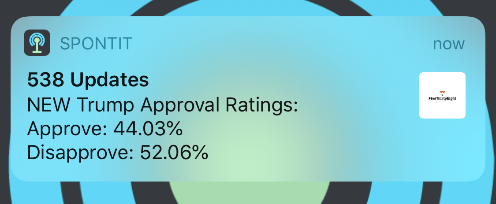

# FiveThirtyEight Poll Push Notifications

Uses the Spontit API to send push notification updates on FiveThirtyEight poll changes.

Check out the <a href="https://github.com/spontit/spontit-api-python-wrapper">Spontit API</a> to send flexible and functional push notifications to iOS, Android, and Desktop devices for free. For this example, all you need is a secret key and a username, which you can get at spontit.com/secret_keys.

You have to create a channel called "538 Updates" for your account first. You can do this by creating one using the <a href="https://apps.apple.com/us/app/spontit/id1448318683">iOS App</a> or by following the "create_new_channel_and_push_to_it" example located <a href="https://github.com/spontit/spontit-api-python-wrapper/blob/master/spontit/examples.py">here</a>.

To follow the hosted channel, go to <a href="spontit.com/liveupdates/538updates">spontit.com/liveupdates/538updates</a>. You can view your own channel link by using the `get_invite_options` function in SpontitResource. To see how to use it, import SpontitResource (`from spontit import SpontitResource`) and then run the python command `help(SpontitResource)`.

Once you get it working, you should see something like this.

## Run Locally
To run locally, simply run the program and it should work. Not a great long-term solution though.

## Run on an EC2 Server

Running it on a server will make the program run as long as you'd like.

First, <a href="https://docs.aws.amazon.com/AWSEC2/latest/UserGuide/ec2-key-pairs.html">start an EC2 instance and get your PEM keys</a>.

Copy the main.py from our repo into your server. Make sure it works locally first.

`scp -i /path/to/your/server_keys.pem /path/to/the/clone/repo/main.py  ec2-user@ec2-ip-address.amzon-region.compute.amazonaws.com:/home/ec2-user`

SSH into your server.

`ssh -i /path/to/your/server_keys.pem ec2-user@ec2-ip-address.amzon-region.compute.amazonaws.com:/home/ec2-user`

Use `tmux` to run your program in the background and leave it running after you exit.

`tmux attach`

Run the program after attaching via `tmux`.

`python3 main.py`

To exit tmux without stopping the program, press the following command. For me, it normally takes about 10 times before I get this command to work, but it does work!

`Control B + D`